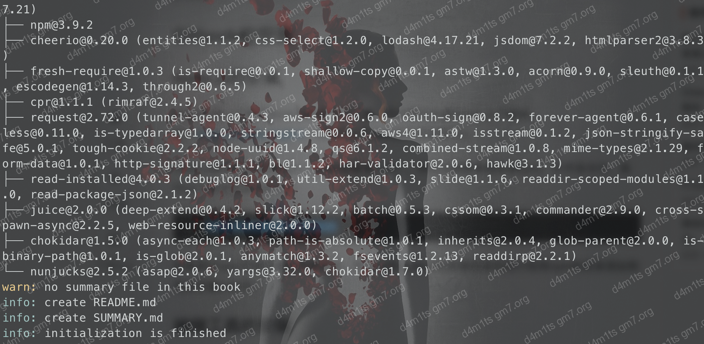
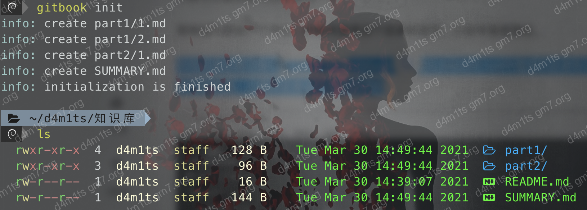
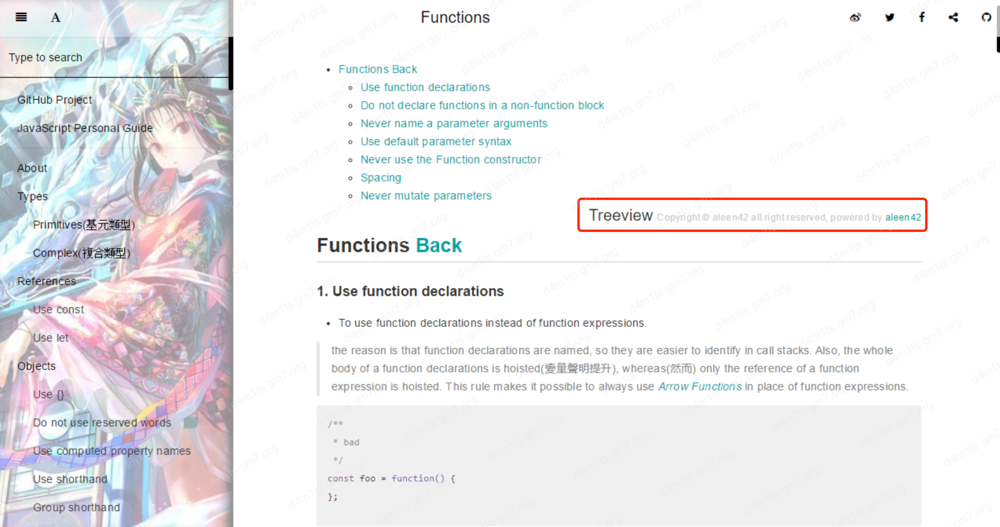
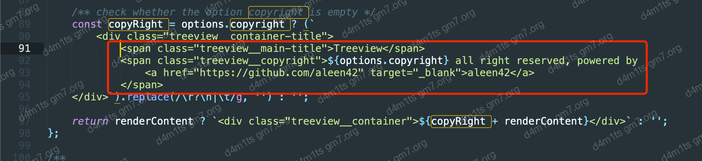

> [!Note]
>
> https://www.latelee.org/my-study/gitbook-note.html
>
> https://jiangminggithub.github.io/gitbook/1-install.html

## 安装

>  需要node 10.x，不然后面初始化会报错

```bash
npm install -g gitbook-cli
```

## 初始化

```bash
gitbook init
```



初始化过后会多2个文件，分别是

```
README.md（书籍的介绍在这个文件里）
SUMMARY.md（书籍的目录结构在这里配置）
```

## 写目录

> 可以参考最下面的一键生成

```markdown
* [CS](CS/CS.md)
    * [1.破解CS](CS/破解CS.md)
    * [2.Malleable C2 Profiles](CS/Malleable-C2-Profiles.md)
    * [3.启动](CS/启动.md)
    * [4.目录和菜单中文说明](CS/目录和菜单中文说明.md)
    * [5.Beacon](CS/Beacon.md)
    * [6.进阶：隐藏C2 - 通过特征](CS/进阶：隐藏C2 - 通过特征.md)
    * [7.进阶：隐藏C2 - 通过CDN](CS/进阶：隐藏C2 - 通过CDN.md)

* 内网
    * [1.内网基础知识整理](内网/1.内网基础知识整理.md)
    * [2.Kerberos协议](内网/2.kerberos协议.md)
    * [3.委派](内网/3.委派.md)
    * [4.ACL](内网/4.ACL.md)
    * [5.域环境搭建](内网/5.域环境搭建.md)
    * [6.内网渗透流程](内网/6.内网渗透流程.md)
    * [7.网络环境的判断](内网/7.网络环境的判断.md)
    * [8.内网权限提升](内网/8.内网权限提升.md)
    * [9.信息收集](内网/9.信息收集.md)
    * [10.横向移动](内网/10.横向移动.md)
    * [11.工具小结](内网/11.工具小结.md)
    * [12.攻击手法](内网/12.攻击手法.md)
```


## 更新

写完目录后再次执行`gitbook init` 

Gitbook会查找SUMMARY.md中描述的目录和文件，如果没有则会创建。上面的目录运行后是这样的



## 启动WEB

```shell
gitbook serve
```


## 生成静态网站

```shell
gitbook build --format website
```

## 安装插件

新建`book.json`输入以下内容

> [!NOTE]
>
> 这些都是我自己使用的插件，算是做个备份汇总吧

```json
    {
        "title" : "d4m1ts 知识库",
        "author" : "d4m1ts",
        "description" : "个人的部分知识技能，倾向于使用知识库的方式进行总结回顾自己",
        "theme-default": {
            "showLevel": true
        },
        "plugins": [
            "-lunr", "-search", "search-plus", "-highlight", "chapter-fold",
            "expandable-chapters","splitter", "page-treeview", "lightbox",
            "donate", "hide-element", "code", "tbfed-pagefooter",
            "pageview-count", "ancre-navigation", "anchor-navigation-ex", "insert-logo",
            "favicon","github","flexible-alerts","prism","copyright"
        ],

        "pluginsConfig": {
            "page-treeview": {
                "copyright": "Copyright &#169; d4m1ts",
                "minHeaderCount": "2",
                "minHeaderDeep": "2"
            },
            "donate": {
                "wechat": "/README.assets/wx.jpeg",
                "alipay": "/README.assets/alipay.jpeg",
                "title": "",
                "button": "打赏☕️",
                "alipayText": "支付宝打赏",
                "wechatText": "微信打赏"
            },
            "hide-element": {
                "elements": [".gitbook-link", ".treeview__copyright", ".treeview__main-title"]
            },
            "tbfed-pagefooter": {
                "copyright":"Copyright &copy d4m1ts 2022",
                "modify_label": "该文章修订时间：",
                "modify_format": "YYYY-MM-DD HH:mm:ss"
            },
            "insert-logo": {
                "url": "/README.assets/logo.png",
                "style": "background: none; max-height: 40px; min-height: 40px"
            },
            "favicon": {
                "shortcut": "/README.assets/favicon.ico",
                "bookmark": "/README.assets/favicon.ico",
                "appleTouch": "/README.assets/favicon.ico",
                "appleTouchMore": {
                    "120x120": "/README.assets/favicon.ico",
                    "180x180": "/README.assets/favicon.ico"
                    }
            },
            "github": {
                "url": "https://github.com/damit5"
            },
            "flexible-alerts": {
                "style": "callout",
                "comment": {
                  "label": "Comment",
                  "icon": "fa fa-comments",
                  "className": "info"
                }
            },
            "prism": {
                "css": [
                    "prismjs/themes/prism-tomorrow.css"
                ],
                "lang": {
                    "flow": "typescript"
                },
                "ignore": [
                    "mermaid",
                    "eval-js",
                    "ascii",
                    "result",
                    "manifest",
                    "payload",
                    "google",
                    "tree",
                    "java_out",
                    "log4j2",
                    "jsp",
                    "class",
                    "Exception",
                    "stack"
                ]
            },
            "copyright": {
                "site": "https://blog.gm7.org/",
                "author": "d4m1ts",
                "website": "d4m1ts 知识库",
                "image": "",
                "copyProtect": true
            }
        }
    }
```

然后运行

```bash
gitbook install
```

然后启动就可以了

```bash
gitbook serve
```

> https://www.jianshu.com/p/2160f1ba68a0


### 常用插件

```
# 全面
https://jiangminggithub.github.io/gitbook/6-third_plugins.html
https://www.jianshu.com/p/427b8bb066e6
https://segmentfault.com/a/1190000019806829
http://jartto.wang/2020/02/02/about-gitbook/
https://juejin.cn/post/6844903865146441741
https://github.com/orgs/GitbookIO/repositories?type=all
https://github.com/search?q=gitbook-plugin-&type=all
```

### 快速生成summary

> https://blog.csdn.net/weixin_34383618/article/details/91629912

```shell
npm install -g gitbook-summary
book sm
book sm -i node_modules,_book	# 忽略 node_modules和_book目录
```

###  flexible-alerts 高级格式显示的提示块

**用法：**

```
> [!type|style:xx|label:xx|icon:xx|className:xx|labelVisibility:xx|iconVisibility:xx]
> 内容部分
```

字段介绍，如果不设置的表示选择默认，除了`!type`都不是必需的。

| 键              | 允许的值                            | 说明                                               |
| :-------------- | :---------------------------------- | :------------------------------------------------- |
| !type           | `NOTE`，`TIP`，`WARNING`和`DANGER`  | 警告级别设置                                       |
| style           | 以下值之一: callout（默认）, flat   | 警告样式，见图19的左右不同                         |
| label           | 任何文字                            | 警告块的标题位置，即Note这个字段位置（不支持中文） |
| icon            | e.g. 'fa fa-info-circle'            | 一个有效的Font Awesome图标，那块小符号             |
| className       | CSS类的名称                         | 指定css文件，用于指定外观                          |
| labelVisibility | 以下值之一：visible（默认），hidden | 标签是否可见                                       |
| iconVisibility  | 以下值之一：visible（默认），hidden | 图标是否可见                                       |

**实例：**

```markdown
1. 这是简单的用法
> [!NOTE]
> 这是一个简单的Note类型的使用，所有的属性都是默认值。

---
2. 这是自定义属性的用法
> [!NOTE|style:flat|lable:Mylable|iconVisibility:hidden]
> "!type":`NOTE`、"style":`flat`、"lable":`自定义标签`、图标不可见
```


1、Note
> [!NOTE]
> 这是一个简单的Note类型的使用，所有的属性都是默认值。


2、TIP
> [!TIP]
> TIPS

3、WARNING
> [!WARNING]
> WARNING|WARNING

4、DANGER
> [!DANGER]
> DANGER

5、自定义
> [!COMMENT]
> 自定义的，在book.json中配置

6、正常

> 正常测试

7、高级使用

> [!NOTE|style:flat|lable:Mylable]
> "!type":`NOTE`、"style":`flat`、"lable":`自定义标签`、图标可见

### page-treeview 生成页内目录

生成后，会出现这一行，想要删除有2种方法：



1. 直接用`hide-element`来隐藏，治标不治本
2. 直接修改插件源码`node_modules/gitbook-plugin-page-treeview/lib/index.js`，删除如下部分即可



### 二次修改插件

有时候一些插件不太合心意，可以稍微修改修改

> [!TIP|style:flat]
>
> 修改其他插件一样，找到路径就行了，`node_modules/gitbook-plugin-xxx`里面的`index.js`

主要参考上面的`page-treeview`修改

本网站主要修改了2个插件：

1. `page-treeview`
2. `copyright`：去除了最下面的版权信息，因为感觉不好看。。。

### 其他

* https://github.com/snowdreams1006/gitbook-plugin-readmore
* https://snowdreams1006.github.io/gitbook-plugin-copyright/dev/zero2one.html

## 问题

gitbook的模板引擎会渲染一些内容，可能因为内容会抛出异常`Template render error:`

> https://stackoverflow.com/questions/41498252/gitbook-template-render-error-unknown-block-tag-static

举一些可能抛出异常的例子，用代码块``正常格式和起来就行

```markdown
- `{{ }}`
* `{{ }}`

    ```test
		{{ aaa }}
    ```
```

