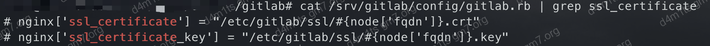
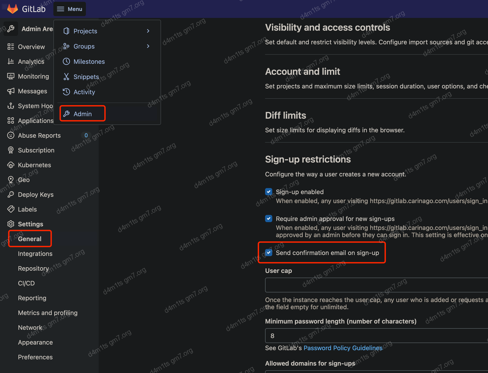

## 前言

需要用到Gitlab，但是其他地方的不放心，看了下有docker版的，所以搭一个记录一下。


## 过程

### 安装

> [!NOTE]
>
> 主要参考官方文档：https://docs.gitlab.com/ee/install/docker.html#install-gitlab-using-docker-compose

安装好docker后，创建一个`docker-compose.yml`，如下：

```yaml
version: '3.6'
services:
  web:
    image: 'gitlab/gitlab-ee:latest'
    restart: always
    hostname: 'gitlab.gm7.org'
    environment:
      GITLAB_OMNIBUS_CONFIG: |
        # Add any other gitlab.rb configuration here, each on its own line
        external_url 'https://gitlab.gm7.org'
        gitlab_rails['gitlab_shell_ssh_port'] = 2222
    ports:
      - '80:80'
      - '443:443'
      - '2222:22'
    volumes:
      - '/srv/gitlab/config:/etc/gitlab'
      - '/srv/gitlab/logs:/var/log/gitlab'
      - '/srv/gitlab/data:/var/opt/gitlab'
    shm_size: '256m'
```

然后执行如下命令即可：

```shell
docker-compose up -d
```

等它ok，gitlab就搭建好了，没啥技术含量


### 映射目录说明

GitLab中主要三个目录需要被映射出来，分别是

- *`/etc/gitlab`* : 配置文件目录。GitLab的主要配置文件 ***gitlab.rb*** 保存在这个目录
- *`/var/opt/gitlab`* ：GitLab的运行目录和数据保存目录
- *`/var/log/gitlab`* : GitLab的日志目录

## 一些问题

> 配置设置：https://docs.gitlab.com/omnibus/settings/

### 设置root密码

> 设置其他信息，比如邮箱啥的，都一样

网上全部都说访问第一次网页会提示设置root密码，然而我没看到设置root密码的地方，就找到了另一种方法：直接进容器里面改

```shell
docker exec -it gitlab_web_1 /bin/bash
# 执行后等它加载完
gitlab-rails console -e production
# 获取root用户
user = User.where(id: 1).first
# 设置密码
user.password = 'test123...'
user.password_confirmation = 'test123...'
# 保存
user.save!
# 退出
exit
```


去网页端登陆，OK


### 配置自己的证书

gitlab会在 *`config/ssl`* 目录下生成自签名证书，但因为没有CA认证，所以重配置命令最后会报证书检查错误，不过不影响配置生效，浏览器会有安全警告，需要手动接受证书或者访问会被阻止。

如果有CA认证证书，可以按照以下步骤安装和配置

首先将认证证书和密钥文件放置在 *config/ssl* 目录下，然后修改NGINX的SSL证书配置（`config/github.rb`中）。例如：

```
nginx['ssl_certificate'] = "/etc/gitlab/ssl/gitlab.gm7.org.pem"
nginx['ssl_certificate_key'] = "/etc/gitlab/ssl/gitlab.gm7.org.key"
```



保存配置修改后，执行 `docker exec -it gitlab_web_1 gitlab-ctl reconfigure` 使变更生效。接下来就可以完全正常的通过浏览器访问安全地址了。

> [!WARNING]
>
> **必须要将 `external_url` 配置为HTTPS地址，GitLab才会开启HTTPS，只配置证书不会开启HTTPS。**

### 集成证书

gitlab可以自动集成[Let's Encrypt](https://letsencrypt.org/)的证书，而无需我们配置

修改`conf/gitlab.rb`，对主域的**Let's Encrypt**支持：

```ruby
letsencrypt['enable'] = true                      # GitLab 10.5 and 10.6 require this option
external_url "https://gitlab.example.com"         # Must use https protocol
letsencrypt['contact_emails'] = ['foo@email.com'] # Optional
```

**自动更新SSL证书**，还是修改配置文件，默认配置文件是每4天午夜的时候更新，也可以使用如下配置

```ruby
letsencrypt['auto_renew'] = true
# This example renews every 7th day at 12:30
letsencrypt['auto_renew_hour'] = "12"
letsencrypt['auto_renew_minute'] = "30"
letsencrypt['auto_renew_day_of_month'] = "*/7"
```

**手动更新SSL证书**

```shell
gitlab-ctl renew-le-certs
```

**刷新配置**

```shell
gitlab-ctl reconfigure
```


### 配置HTTP跳转

当HTTPS开启之后，GitLab会关闭HTTP访问。此时可以配置GitLab将HTTP请求转发到HTTPS，但不能只以HTTP方式访问。

修改 *`config/gitlab.rb`* 修改以下配置：

```
nginx['redirect_http_to_https'] = true
nginx['redirect_http_to_https_port'] = 80
```

保存配置修改后，执行 `docker exec -it gitlab_web_1 gitlab-ctl reconfigure` 使变更生效。此时，再访问HTTP地址，就会跳转到HTTPS。

### 配置SSH端口

使用Docker部署GitLab，由于一般22端口已经被宿主服务器使用了，需要将GitLab SSH服务的22端口映射到其他端口。接下来以使用2222端口为例。

> [!NOTE]
>
> 上面我们已经用本地2222端口映射了内部的22端口了，所以不需要再单独映射了

修改 *`config/gitlab.rb`* 

```
gitlab_rails['gitlab_shell_ssh_port'] = 8122
```


保存配置修改后，执行 `docker exec -it gitlab_web_1 gitlab-ctl reconfigure` 使变更生效。

### 关闭自带NGINX

GitLab自带的NGINX可以关闭，但此时需要配置Workhorse服务，因为默认情况下Workhorse只监听Unix Socket。

在 *`config/gitlab.rb`* 中添加以下配置：

```
nginx['enable'] = false
gitlab_workhorse['listen_network'] = "tcp"
gitlab_workhorse['listen_addr'] = "0.0.0.0:8181"
```

上例中的配置将使Workhorse监听8181端口。保存配置修改后，执行 `docker exec -it gitlab_web_1 gitlab-ctl reconfigure` 使变更生效。

> [!WARNING]
>
> **在启动容器时需要将Workhorse监听的端口映射出来。**

### 配置Nginx反向代理

通常情况下都会在GitLab前放置一个Nginx做为服务的反向代理。这时，需要对Nginx和GitLab的配置都做出调整。

例如，首先在用来做反向代理的Nginx中，添加以下服务配置：

```
upstream gitlab-workhorse {
    server 192.168.1.18:8181;
}

server {
  listen *:80;

  server_name my-gitlab;
  server_tokens off; 

  gzip on;

  proxy_set_header Host $http_host_with_default;
  proxy_set_header X-Real-IP $remote_addr;
  proxy_set_header X-Forwarded-For $proxy_add_x_forwarded_for;

  location / {
    proxy_cache off;
    proxy_pass  http://gitlab-workhorse;
  }
}
```

以上配置中，假设GitLab服务监听的是 *192.168.1.18* 上的 *8181* 端口。`X-Real-IP`和`X-Forwarded-For`两个Header用来向GitLab服务传递客户端的真实IP。

为了让GitLab后端能够正常从 `X-Real-IP` 和 `X-Forwarded-For` 中读取客户端的IP，需要在 *config/gitlab.rb* 添加以下配置：

```
nginx['real_ip_trusted_addresses'] = ['192.168.1.0/24', '172.17.0.0/24']
```

当Nginx代理也是Docker容器时，其IP有可能是172.17.0.0网段，所以这里也在配置中添加了这个网段。

> [!WARNING]
>
> **无论GitLab自带的Nginx服务是否开启，都需要添加这个配置**

### 邮箱配置

> 参考：https://docs.gitlab.com/omnibus/settings/smtp.html?spm=a2c6h.12873639.0.0.5edfaf686YW1R0#smtp-settings

修改 *`config/gitlab.rb`* 


还有


保存配置修改后，执行使变更生效。

```shell
docker exec -it gitlab_web_1 gitlab-ctl reconfigure
```

邮件发送测试（发送标题和正文不能包含中文）

```shell
docker exec -it gitlab_web_1 /bin/bash
# 控制台，等几分钟
gitlab-rails console
# 发送测试邮件
Notify.test_email('收件人邮箱', '邮件标题', '邮件正文').deliver_now
```


### 上传文件过大

提示

```
error: RPC failed; HTTP 413 curl 22 The requested URL returned error: 413 Request Entity Too Large
```

出现以上问题同样是因为上传软件包过大，需要我们在nginx参数中进行调整设置文件传输大小的限制。需要注意的是，如果是反向代理的Gitlab需要我们将两台服务器的nginx都进行设置。

```shell
grep -r "client_max_body_size" /srv/gitlab
```

`config/gitlab.rb`设置

```
nginx['client_max_body_size'] = '1024m'
```

> [!TIP]
>
> 还是不行建议用ssh

### 开启邮箱验证



### 禁用avatar头像

头像服务器在国外，开启头像可能会因为加载不出来头像而阻塞正常图片的加载


